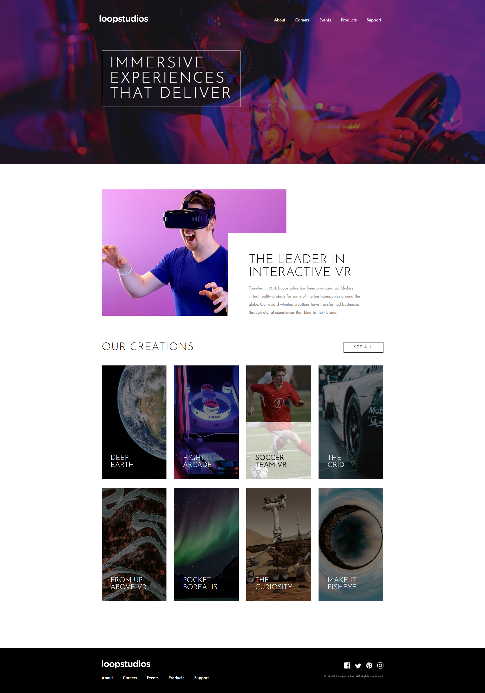

# Loopstudios Landing Page

## Visão Geral

### Projeto de uma landing page que oferece entretenimento através de experiência de imersão em realidade virtual VR
#

#
## Construido com:
- HTML
- CSS
- JavaScript

## Funcionalidades
- Landing Page que oferece entretenimento através de experiência de imersão em realidade virtual VR

## O que eu aprendi:
- Manipulação do DOM
- Design responsivo
- Eventos
- Boas práticas com JavaScript

## Link

Veja o projeto aqui: [Acessar🌍](https://devhiderlan.github.io/loopstudios-landing-page/)  

## Autor

Hiderlan Santana: [Linkedin](https://www.linkedin.com/in/hiderlan-santana/)